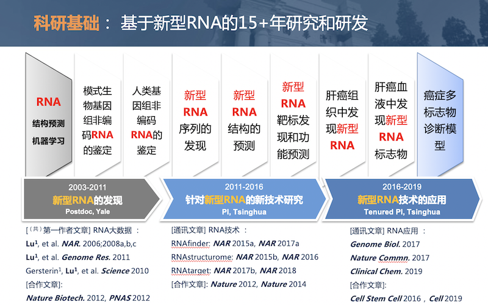
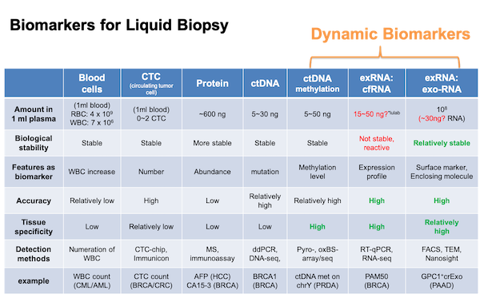
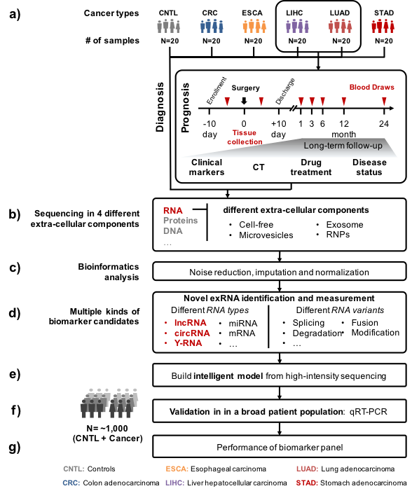
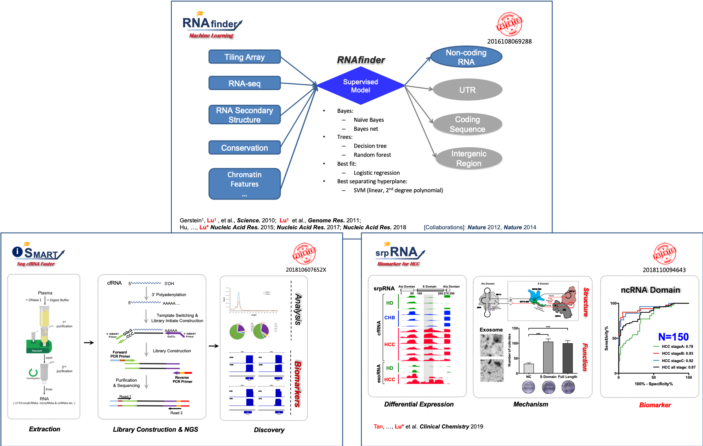

# 清华大学鲁志实验室癌症检测科研项目寻求合作医院及临检机构
#### **更新日期：** 2019-05-21

## 基本信息 

- **招募机构：医院或临检机构等**   
- **样本需求：癌症病人和健康对照人群的血液、唾液等**   
- **起止日期：长期招募** 
- **合作课题：癌症早筛、早诊和预后中新型体液游离RNA标志物的研究**  
- **发起组织：清华大学生命学院鲁志实验室**  

## 研究目标

#### **我们的使命，是帮助人们更早期的发现癌症，因为“上工治未病”**

 该癌症检测项目的目的是要为癌症早期筛查、早期诊断以及预后治疗寻找到更好（精准、重复性高、经济上利于普及大众、操作上简单无创）的新型体液标志物（exRNA），并标准化其检测和解析流程，开发出新的液体活检技术。 

## 实验室简介

  清华大学生命学院鲁志实验室致力于发展生物信息学技术，并探索能够广泛应用于基因组学和癌症生物学的医学实践。我们利用高通量测序，结合机器学习和人工智能技术，来研究遗传信息是如何被编码在结构化的DNA和RNA分子之中，以及它们是如何在一个生命体系中相互作用、彼此调控。我们相信，这种使命感以及为此付出的实践和努力，将帮助我们理解和治疗人类疾病，并最终认识和提高我们自己。
  
> 实验室负责人鲁志([官方主页](http://life.tsinghua.edu.cn/publish/smkx/11230/2018/20180102030120630761402/20180102030120630761402_.html))博士，清华大学生命科学学院 研究员，博士生导师，国家“优秀青年”基金、“霍英东”青年基金获得者。鲁志博士10余年来一直致力于非编码RNA相关的生物信息学研究，发表国际重要期刊文章50余篇([Pulibcation List](http://bioinformatics.life.tsinghua.edu.cn/home/research&publications/publications.html)),包括Science, Genome Res., Genome Biology, Nature Communications, Nucleic Acids Research 等, 总引用超过10,000 次（[Google Scholar Site](https://scholar.google.com/citations?user=wrtnAbEAAAAJ&hl=en))；其中，近5年的通讯作者文章约20篇（影响因子10分以上的10篇）。
  
 
## 项目简介

  本项目将基于基因组学和生物信息学，通过开发体液RNA微量测序技术和机器学习方法，在体液中发现和鉴定与癌症发生发展相关的新型exRNA标志物，应用于国内高致死癌症的早期诊断和预后辅助治疗。exRNA指的是胞外RNA，包括的类型很多，例如miRNA,Y RNA,circRNA,lncRNA等。RNA标志物与DNA和蛋白标志物相比，具有更好的敏感性、组织特异性和多样性，给更好的临床检验带来了新的期望。我们在新型非编码RNA和生物信息学研究方面积累了丰富经验，基于此，我们将在癌症病人体液（如血液）中发现和分析标志癌症发生发展的新型exRNA，并整合现有标志物构建多重标志物的智能模型，在大样本上进行验证，建立具有更高精准度和可重复性的无创检验方法。

  我们在非编码RNA(ncRNA)测序和生物信息学研究中积累了10余年的丰富经验，例如，我们在模式生物和肝癌样本中通过测序和生物信息学分析发现了很多新的lncRNA（Science 2010; Nature 2012; Nature 2014; Nature Communications 2017), 其中有不少具有很好的标志物特性。从2017年起，实验室开始大力发展针对体液无创检测技术的研究，我们已经克服了体液游离RNA易降解及微量建库的技术难题，开发了自主研发的超微量RNA测序技术i-SMART(专利申请号：201810607652X）和基于机器学习和人工智能的生物信息学方法exSEEK、RNAfinder（专利号：2016108069288）(Genome Res. 2011; Nucleic Acids Res. 2015; Nucleic Acids Res. 2017a)，发现了一些新的exRNA标志物（专利申请号:2018110094643)(Clinical Chemistry 2019)，积累了癌症相关的RNA数据库（著作权号：2016R11S367236）(Nucleic Acids Res. 2017b; Nucleic Acids Res. 2019)，为癌症无创检测试剂盒的开发提供有力的支持。

> 针对新型RNA的10余年研究经验和主要成果
> 

> 各种无创检测（液体活检）技术对比
> 

## 样本收集与临床队列设计

 该课题将针对多种国内高致死率或高发的癌症，如肺癌、胃癌、肝癌、食管癌、结直肠癌、乳腺癌、胰腺癌等，收集患者的血浆，用以发现新型exRNA标志物。随后，我们将建立标准的实验检测方法与生物信息学算法，开发设计无创检测试剂盒，用于癌症的早期筛查、早期诊断和预后辅助治疗。样本收集与临床队列设计如下：

> 

## 合作方式  

* **I期. 新型标志物的“发现和探索”阶段**  
  * 贵院/临检机构负责收集 **少量（30-50例血样）** 癌症病人和/或健康对照人群的血浆，妥善储存并运输；  
  * 鲁志实验室负责进行预实验和分析，实验和分析费用由鲁志实验室承担；  
  * 共同发表文章。 

* **II期. 新型标志物的“鉴定和验证”阶段**  
  * 在前期预实验效果较好的前提下，还需要在 **大量样本（200-500例血样）** （最好部分血样能配套组织样本）中进行测序和验证；
  * 实验费用由双方共同承担；
  * 共同发表文章和申请专利，具体合作事宜面议。 

* **III期. 大规模临床验证、试剂盒开发和产业化阶段**  
  * 共同寻找投资和合作伙伴;
  * 协助进行试剂盒的开发、申报（**提供样本1000例以上**）及推广，具体合作事宜面议。

## 合作方资质需求

具有收集癌症病人和/或健康对照人群体液样品的资质 （最好也具有试剂盒的开发及推广的经验和资质的机构或公司）。

## 已有合作单位

- **北京** 北京大学第一医院  
- **北京** 中国医学科学院（协和医院）肿瘤医院  
- **北京** 解放军302医院  
- **上海** 海军军医大学  
- **天津** 天津市肿瘤医院  
- **重庆** 陆军军医大学  
- **重庆** 重庆开州人民医院

## 代表性论文

*	Chang Tan1, Jingyi Cao1, Lu Chen1, Xiaochen Xi, Siqi Wang, Yumin Zhu, Liuqing Yang, Longteng Ma, Dong Wang, Jianhua Yin\*, Ti Zhang\* and **Zhi John Lu*** (2019) Noncoding RNAs serve as diagnosis and prognosis biomarkers for hepatocellular carcinoma **_Clinical Chemistry_** 65:7 (1 contributed equally, \* co-corresponding) (IF: 8) 
* Yang Yang1, Lei Chen1, Jin Gu1, Hanshuo Zhang1, Jiapei Yuan, Qiuyu Lian, Guishuai Lv, Siqi Wang, Yang Wu, Yu-Cheng T. Yang, Dongfang Wang, Yang Liu, Jing Tang, Guijuan Luo, Yang Li, Long Hu, Xinbao Sun, Dong Wang, Mingzhou Guo, Qiaoran Xi, Jianzhong Xi, Hongyang Wang\*, Michael Q. Zhang\* and **Zhi John Lu*** (2017) Recurrently deregulated lncRNAs in hepatocellular carcinoma. **_Nature Communications_** 8, 14421 (1 contributed equally, \* co-corresponding) (IF: 12) 
* Yang Eric Li1, Mu Xiao1, Binbin Shi1, Yu-Cheng T. Yang, Dong Wang, Fei Wang, Marco Marcia and **Zhi John Lu*** (2017) Identification of high-confidence RNA regulatory elements by combinatorial classification of RNA-protein binding sites. **_Genome Biology_** 18:169 (1contributed equally) (IF: 13) 
* Boqin Hu1, Yu-Cheng T. Yang1, Yiming Huang, Yumin Zhu and **Zhi John Lu*** (2017) POSTAR: a platform of post-transcriptional regulation coordinated by RNA binding proteins. **_Nucleic Acids Research_** 45 (D1): D104-D114 (1contributed equally) (IF: 11) 
* Long Hu, Zhiyu Xu, Boqin Hu and **Zhi John Lu*** (2017) COME: a robust coding potential calculator for lncRNA identification and characterization based on multiple features. **_Nucleic Acids Research_** 45 (1): e2  (IF: 11) 
* Yang Wu1, Binbin Shi1, Xinqiang Ding, Tong Liu, Xihao Hu, Kevin Y. Yip, Zheng Rong Yang, David H. Mathews and **Zhi John Lu***(2015) Improved prediction of RNA secondary structure by integrating the free energy model with restraints derived from experimental probing data. **_Nucleic Acids Research_** 43(15): 7247-59\. (1contributed equally) (IF: 11)

## 代表性合作

* Sai Luo, J. Yuyang Lu, Lichao Liu, Yafei Yin, Chunyan Chen, Xue Han, Bohou Wu, Ronggang Xu, Wei Liu, Pixi Yan, Wen Shao, **Zhi Lu**, Haitao Li, Jie Na, Fuchou Tang, Jianlong Wang, Yong E. Zhang, Xiaohua Shen (2016) Divergent lncRNAs Regulate Gene Expression and Lineage Differentiation in Pluripotent Cells. **_Cell Stem Cell_** 18, 1–16
* MB, Joel Rozowsky, Koon-Kiu Yan, …, **Lu Z,** …, Robert Waterston (2014) Comparative Analysis of the Transcriptome across Distant Species. **_Nature_** 512(7515):445-448.
* ENCODE Project Consortium#. (2012) An Integrated Encyclopedia of DNA Elements in the Human Genome. **_Nature_** 489, 57–74\. (#**Lu Z** is part of ENCODE Consortium) [Cover Story]
* Gerstein MB 1\*, **Lu ZJ**1, Van Nostrand EL1, Cheng C1, Arshinoff BI1, et al. (2010) Integrative analysis of the _Caenorhabditis elegans_ genome by the modENCODE project. **_Science_** 330(6012): 1775-1787 (120 co-first authors, \* 15 co-corresponding authors, ~150 authors in total) [Cover Story]

## 相关专利

* 基于机器学习的生物信息方法RNAfinder（专利号：2016108069288）(Genome Res. 2011; Nucleic Acids Res. 2015; Nucleic Acids Res. 2017a)
* 超微量RNA捕获和测序技术i-SMART(专利申请号：201810607652X）
* 针对肝癌的一个新exRNA标志物（专利申请号:2018110094643)(Clinical Chemistry 2019)
* 癌症相关的RNA数据库（著作权号：2016R11S367236）(Nucleic Acids Res. 2017b; Nucleic Acids Res. 2019)

## 联系方式

|**地址：** |**清华大学 生命科学学院，生物信息学“教育部重点实验室”， 北京，100084**|  
|:---|:---|  
|**办公电话：** |**+86-10-62789217** |
|**E-mail：** | **lulab1 AT tsinghua.edu.cn** |  
|**实验室主页：** | **[http://bioinfo.life.tsinghua.edu.cn](http://bioinfo.life.tsinghua.edu.cn)** | 

> 

